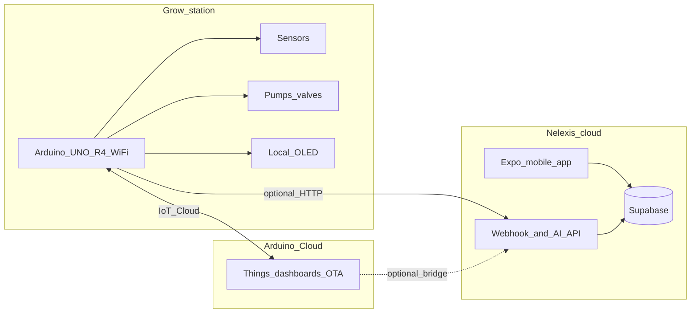

# Nelexis (Nilexis)

**Nelexis** is a hydroponic monitoring and irrigation platform. This repository uses the folder name **Nilexis**; the product name is **Nelexis**—use either consistently in docs and UI as you prefer.

## System map

## Repository layout

| Path | Purpose |
|------|---------|
| [firmware/r4-station](firmware/r4-station) | UNO R4 WiFi sketch: sensors, irrigation state machine, Arduino Cloud properties, optional OLED |
| [supabase/migrations](supabase/migrations) | Postgres schema, RLS, crop templates, calendar fields, firmware version tracking |
| [services/api](services/api) | Next.js API: Arduino telemetry webhook, AI health check (decision-support) |
| [apps/mobile](apps/mobile) | Expo app: stations, plant profiles, daily photos, timeline, calendar |
| [docs](docs) | Pilot runbook, telemetry bridge, pilot checklist, gimbal add-on spec |

## Quick start

1. **Firmware:** See [firmware/r4-station/README.md](firmware/r4-station/README.md) and [docs/RUNBOOK.md](docs/RUNBOOK.md).
2. **Backend:** Create a Supabase project and run migrations in `supabase/migrations/` (includes Storage bucket `plant-photos` and policies).
3. **API:** Copy `services/api/.env.example` to `services/api/.env.local` and set `SUPABASE_*`, `TELEMETRY_SECRET`, optional `OPENAI_API_KEY`. For production, deploy **`services/api`** to Vercel from GitHub (root directory `services/api`); see [services/api/README.md](services/api/README.md#deploy-on-vercel-from-github).
4. **Mobile:** Copy `apps/mobile/.env.example` to `apps/mobile/.env` (Supabase URL + anon key + `EXPO_PUBLIC_API_URL` for AI).
5. **Optional bridge:** [docs/TELEMETRY_BRIDGE.md](docs/TELEMETRY_BRIDGE.md) — copy Cloud telemetry into `sensor_snapshots`.

## Phases (implementation status)

- Phase 1: Firmware + runbook (this repo).
- Phase 2: Supabase + mobile app (profiles, photos, timeline).
- Phase 3: Crop templates, market calendar, cloud AI with human confirmation.
- Phase 4: GitHub Actions CI, firmware version in DB.
- Phase 5: Gimbal camera spec ([docs/GIMBAL_ADDON_SPEC.md](docs/GIMBAL_ADDON_SPEC.md)).

Release readiness: [docs/PILOT_CHECKLIST.md](docs/PILOT_CHECKLIST.md). API smoke: [docs/SMOKE_API.md](docs/SMOKE_API.md). Deferred sun 3D scope: [docs/SUN_3D_PHASE2.md](docs/SUN_3D_PHASE2.md).

## Safety

Hydroponic automation can cause floods or nutrient issues. Always use pump timeouts, physical access to power, and the emergency procedures in the runbook.
